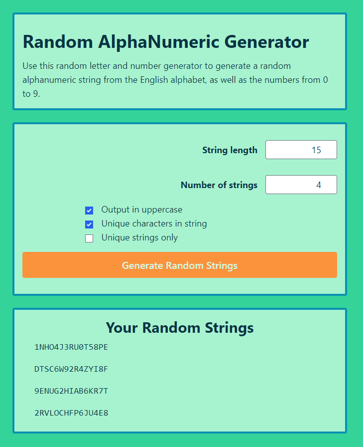

# Small-Projects

Small projects meant to be implemented in around a day of work (less than 8 hours)

## Alphanumeric Generator

React project made with Vite and Tailwind.

Run by opening a console in the project folder, and running:

```
npm install
npm run dev
```

The console should show that the project is hosted on your localhost with a given port number. Copy that url into your browser to view the project live.


